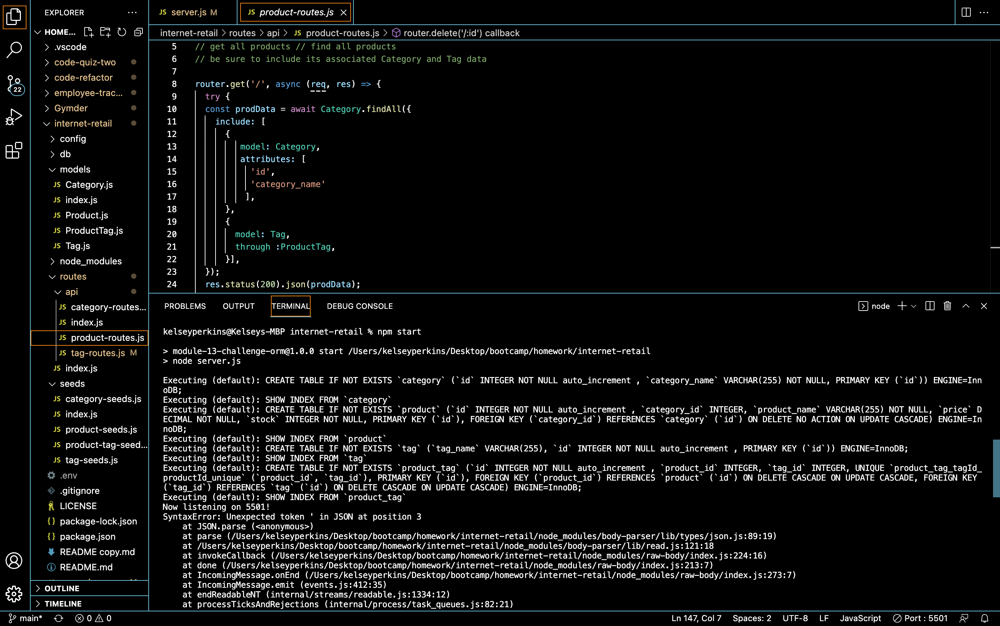

# Project Title: Internet-Retail 

# Description: 
Configured a working Express.js API to use Sequelize to interact with a MySQL database.

## Table of Contents
  - [Installation](#installation)
  - [Usage](#usage)
  - [Video](#video)
  - [Credits](#contributing)
  - [License](#license)
  - [Questions](#questions)

## Installation:
Please install package manager NPM by running the following command in the terminal: 
- npm i 
- npm sequelize

Source your schema, then run the following in terminal:
- npm start

Optional! Intsall Jest to test code. Run the following command in terminal:
- npm i jest

## Usage:
Run the following commnand in the terminal:
- mysql -u root 
- node start

## Video:
- <a href="">Video Link</a>

## Contributing:
  None.

## License:
 The repo is licensed by: APACHE 2.0

## Questions:
Still have questions? Email me! kelseykodes@yahoo.com 